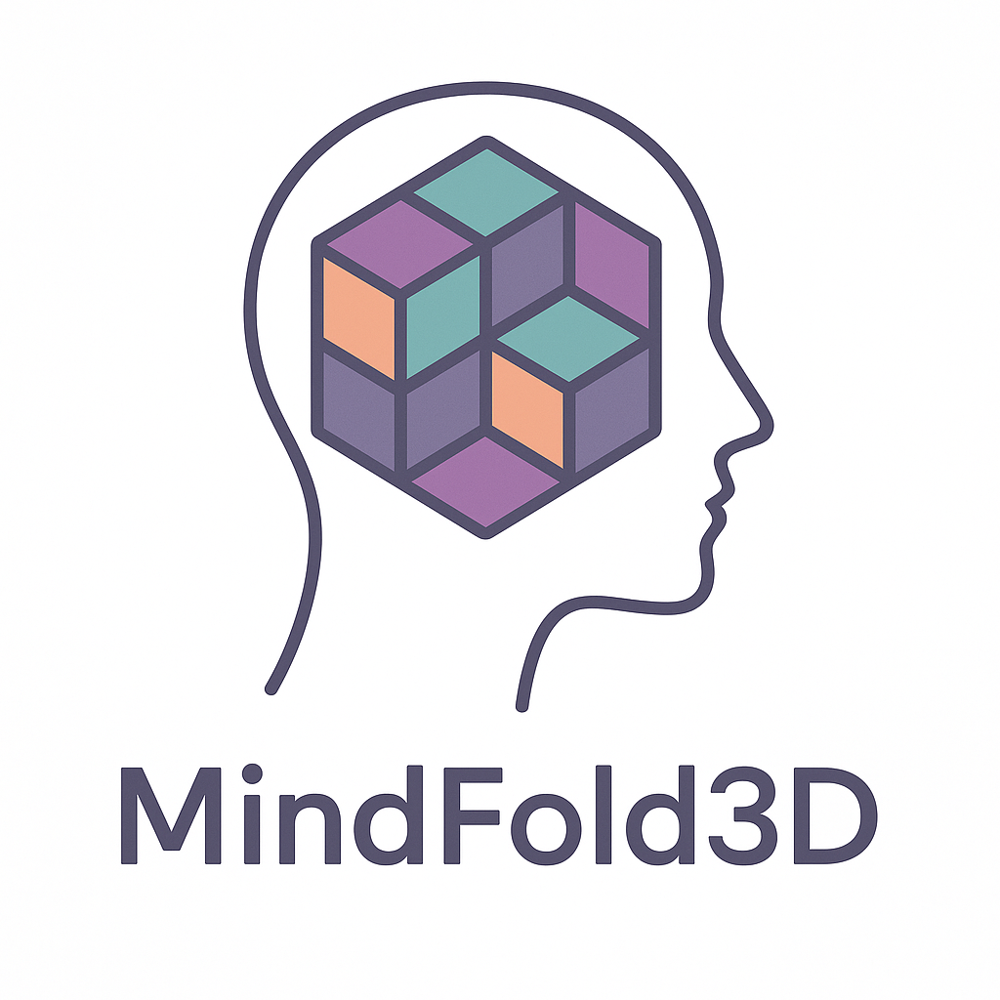

<p align="center">
  
</p>

# MindFold 3D

**Patent Pending** (U.S. provisional application filed April 15, 2026) | Copyright (c) 2024-2026 The Pennsylvania State University. All rights reserved.
Inventors: Scott N. Hwang, Parviz Safadel

Licensed under the Open Core Ventures Source Available License (OCVSAL) v1.0. See [LICENSE](LICENSE). Production use requires a commercial agreement. For commercial licensing, contact the Penn State Office of Technology Transfer at ottinfo@psu.edu.

A computational framework for adaptive spatial cognition assessment and training using procedurally generated 3D voxel stimuli with a layered cognitive architecture.

## Features

- Interactive 3D shape visualization
- Two game modes: Recognition and Builder
- Performance scorecard with per-feature cognitive analytics
- Skeleton-first shape generation with three structural archetypes (tree, chiral, bridge)
- Randomly rotated shapes for increased difficulty
- Real-time feedback with visual and sound effects
- Anonymous session-based play — no registration required
- User profiles
- Responsive design for desktop and mobile devices

## Game Modes

Switch between modes with the icon buttons in the top navigation: 👁 Recognition, ⬛ Builder. Click the **?** button in any mode for in-app instructions.

### Recognition Mode 👁

**Goal:** Identify which of the presented shapes matches the target.

**How to play:**
1. Examine the target shape at the top of the screen.
2. Rotate, pan, or zoom each candidate shape to inspect it from multiple angles (see [Shape Manipulation Controls](#shape-manipulation-controls)).
3. Click the **Choose** button beneath the shape you believe matches the target.
4. You will see immediate feedback (correct/incorrect sound + streak counter), then the next trial begins.

**Difficulty settings (top toolbar):**
- **Memory** — controls when the target is visible:
  - *Simultaneous* — target and choices stay on screen together (easiest).
  - *Delayed (5s view)* — target disappears after 5 seconds; you must recall it.
  - *Delayed (3s + 2s gap)* — target visible 3s, then a 2s blank gap, then choices appear (highest working-memory load).
- **Mirror** — include mirror-image distractors (tests chirality/handedness discrimination).
- **Parts** — include part-permuted distractors (same parts, different spatial arrangement; tests configural binding).
- **Perspective** — shapes render from different camera angles (tests perspective taking).
- **Expert** — 15–25 voxels in a 10×10×10 grid with high topological complexity.

**Session controls:** **Stop Test** ends the current session and shows a summary. **Restart** starts a fresh session.

### Builder Mode ⬛

**Goal:** Reconstruct the target shape voxel-by-voxel in your workspace.

**How to play:**
1. Observe the **TARGET** shape in the upper viewport.
2. The workspace starts with a single seed block. Your job is to add and remove blocks until the workspace matches the target.
3. Click **Add** (blue) — clicking on any face of an existing block places a new block flush with that face.
4. Click **Remove** (gray) — clicking on any existing block deletes it.
5. Click **Check** (green) to verify whether your workspace matches the target (rotation-invariant).
6. Click **Reset** (orange) to restart from a single block.

**Tip:** Rotate the workspace view between edits — it's hard to judge depth from a single angle.

### Performance Scorecard 📊

Accessible from the User menu. Tracks per-feature success rates across trials to identify cognitive strengths and weak areas (mental rotation, mirror discrimination, configural binding, working memory load, topological complexity, etc.). Use it to see which features of the stimulus space you are getting right or wrong and target your practice.

## Tech Stack

- FastAPI (Backend)
- Three.js (3D Graphics)
- Python 3.10 or 3.11
- Modern JavaScript
- SQLAlchemy (Database ORM)
- JWT Authentication

## Development

### Quick start

```bash
pip install -r requirements.txt
cp env.example .env
# edit .env as described below
python main.py
```

Then open http://localhost:3001 in your browser and click **Start Game** to begin. No registration is required.

On Replit, the **Run** button invokes the same command via `.replit`.

### Configuring `.env`

The app reads configuration from environment variables (typically through a `.env` file). Copy `env.example` to `.env` and edit these values:

#### Required

- **`SECRET_KEY`** — used to sign JWT authentication tokens. **Generate your own unique value** and keep it secret; never commit it:
  ```bash
  python -c "import secrets; print(secrets.token_urlsafe(64))"
  ```
  Paste the output into `.env` as `SECRET_KEY=...`. Rotating this key invalidates all existing session tokens.

#### Optional

- **`DATABASE_URL`** — defaults to a local SQLite file (`sqlite:///./mindfold.db`). Set a PostgreSQL URL to use Postgres instead (e.g., on Replit, this is populated automatically).
- **`ACCESS_TOKEN_EXPIRE_MINUTES`** — JWT session lifetime. Defaults to 30.
- **`LLM_BASE_URL`, `LLM_MODEL`, ...** — only needed if you want the AI coach feature. Works with any OpenAI-compatible endpoint (Ollama, LM Studio, vLLM, cloud APIs). Leave unset to disable.


## Sessions

The public build does not support user accounts. Each time you click **Start Game**, the backend issues a new anonymous session backed by a short-lived JWT. Stats (Performance Scorecard) persist for the duration of that session. Clicking **New Game** clears the session and starts a fresh one.

If you need per-participant tracking for a formal study, layer a registration / login flow on top of `/start-session` in your fork.

## Shape Manipulation Controls

Apply to all 3D shapes in Recognition Mode and Builder Mode.

**Desktop:**
- Rotate: left mouse button — press and drag
- Zoom: scroll wheel (or middle mouse button drag)
- Pan: right mouse button — press and drag

**Mobile / touch:**
- Rotate: single finger — press and drag
- Zoom: two-finger pinch / spread
- Pan: two-finger press and drag

## Intellectual Property

This software implements inventions described in a U.S. provisional patent application filed April 15, 2026. For licensing inquiries, contact the Penn State Office of Technology Transfer at ottinfo@psu.edu.

### Acknowledgements

Sound effects used in this project:

- **Correct answer sound** — courtesy of [Mixkit](https://mixkit.co/) (by Envato) under the [Mixkit Free License](https://mixkit.co/license/#sfxFree). Source: https://assets.mixkit.co/active_storage/sfx/1689/1689-preview.mp3
- **Level-up sound** — by [Universfield](https://unil.ink/universfield) via [Pixabay](https://pixabay.com/sound-effects/level-up-4-243762/), used under the [Pixabay Content License](https://pixabay.com/service/license-summary/).
