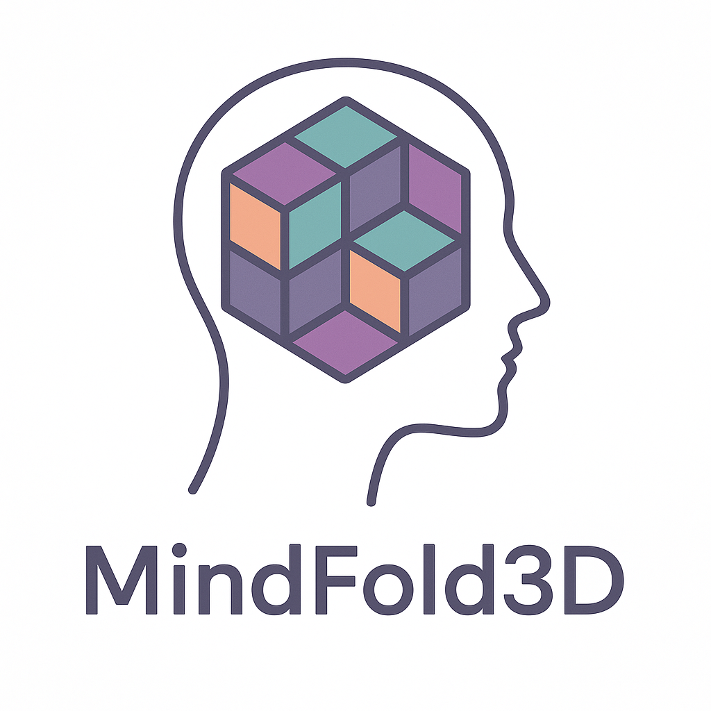

<p align="center">
  
</p>

# MindFold 3D

**Patent Pending** (U.S. provisional application filed April 15, 2026) | Copyright (c) 2026 The Pennsylvania State University. All rights reserved.
Inventors: Scott N. Hwang, Parviz Safadel

Licensed under the Open Core Ventures Source Available License (OCVSAL) v1.0. See [LICENSE](LICENSE). Production use requires a commercial agreement. For commercial licensing, contact the Penn State Office of Technology Transfer at ottinfo@psu.edu.

A computational framework for adaptive spatial cognition assessment and training using procedurally generated 3D voxel stimuli with a layered cognitive architecture.

## Features

- Interactive 3D shape visualization
- Three game modes: Recognition, Builder, and Rhythm
- Performance scorecard with per-feature cognitive analytics
- Skeleton-first shape generation with three structural archetypes (tree, chiral, hole). Cyclic shapes are produced by a topology-guaranteed generator: ring templates physically reserve each intended hole and every emitted shape is certified against a direct cubical first-Betti-number (β₁) computation, with acyclic shapes certified β₁ = 0 the same way. Circuit rank μ of the adjacency graph is retained as an internal control quantity and unscored diagnostic — it is distinct from β₁ and never reported under that name.
- Randomly rotated shapes for increased difficulty
- Real-time feedback with visual and sound effects
- User authentication (login, register, guest access, logout)
- Password reset functionality
- User profiles
- Responsive design for desktop and mobile devices

## Game Modes

Switch between modes with the icon buttons in the top navigation: 👁 Recognition, ⬛ Builder, 🎵 Rhythm. Click the **?** button in any mode for in-app instructions.

### Recognition Mode 👁

**Goal:** Identify which of the presented shapes matches the target.

**How to play:**
1. Examine the target shape at the top of the screen.
2. Rotate, pan, or zoom each candidate shape to inspect it from multiple angles (see [Shape Manipulation Controls](#shape-manipulation-controls)).
3. Click the **Choose** button beneath the shape you believe matches the target.
4. You will see immediate feedback (correct/incorrect sound + streak counter), then the next trial begins.

**Difficulty settings (top toolbar):**
- **Memory** — controls when the target is visible:
  - *Simultaneous* — target and choices stay on screen together (easiest).
  - *Delayed (5s view)* — target disappears after 5 seconds; you must recall it.
  - *Delayed (3s + 2s gap)* — target visible 3s, then a 2s blank gap, then choices appear (highest working-memory load).
- **Mirror** — include mirror-image distractors (tests chirality/handedness discrimination).
- **Parts** — include part-permuted distractors (same parts, different spatial arrangement; tests configural binding).
- **Perspective** — shapes render from different camera angles (tests perspective taking).
- **Expert** — 15–25 voxels in a 10×10×10 grid with high topological complexity.

**Session controls:** **Stop Test** ends the current session and shows a summary. **Restart** starts a fresh session.

### Builder Mode ⬛

**Goal:** Reconstruct the target shape voxel-by-voxel in your workspace.

**How to play:**
1. Observe the **TARGET** shape in the upper viewport.
2. The workspace starts with a single seed block. Your job is to add and remove blocks until the workspace matches the target.
3. Click **Add** (blue) — clicking on any face of an existing block places a new block flush with that face.
4. Click **Remove** (gray) — clicking on any existing block deletes it.
5. Click **Check** (green) to verify whether your workspace matches the target (rotation-invariant).
6. Click **Reset** (orange) to restart from a single block.

**Tip:** Rotate the workspace view between edits — it's hard to judge depth from a single angle.

### Rhythm Mode 🎵

**Goal:** Slash incoming shapes that match the target; avoid the distractors.

**How to play:**
1. On the start screen, pick a **Speed** (Relaxed / Moderate / Intense) and **Rotation** level (None / Slow / Medium / Fast) for the incoming shapes.
2. Press **Start** (or hit **Space**).
3. A target shape is shown at the top. Shapes stream toward you down a three-lane corridor.
4. Move your ship between lanes with **A**/**D** or **←**/**→**.
5. **Click** a shape to slash it. Match the target → +points and combo bonus. Hit a distractor → penalty.
6. Missing a matching shape (letting it pass) also costs the combo.
7. The round ends when the batch is exhausted; you can **Play Again** or return to the main app.

### Performance Scorecard 📊

Accessible from the User menu. Tracks per-feature success rates across trials to identify cognitive strengths and weak areas (mental rotation, mirror discrimination, configural binding, working memory load, topological complexity, etc.). Use it to see which features of the stimulus space you are getting right or wrong and target your practice.

## Tech Stack

- FastAPI (Backend)
- Three.js (3D Graphics)
- Python 3.10–3.12 (developed on 3.12.3)
- Modern JavaScript
- SQLAlchemy (Database ORM)
- JWT Authentication

## Development

### Quick start

```bash
pip install -r requirements.txt
python main.py
```

Then open http://localhost:3001 in your browser and register a new account, or click **Continue as Guest** for a no-signup session.

On Replit, the **Run** button invokes the same command via `.replit`.

### Configuring `.env`

The app reads configuration from environment variables (typically through a `.env` file). Copy `env.example` to `.env` and edit these values:

#### Required

- **`SECRET_KEY`** — used to sign JWT authentication tokens. **Generate your own unique value** and keep it secret; never commit it:
  ```bash
  python -c "import secrets; print(secrets.token_urlsafe(64))"
  ```
  Paste the output into `.env` as `SECRET_KEY=...`. Rotating this key invalidates all existing login sessions.

#### Optional

- **`DATABASE_URL`** — defaults to a local SQLite file (`sqlite:///./mindfold.db`). Set a PostgreSQL URL to use Postgres instead (e.g., on Replit, this is populated automatically).
- **`ACCESS_TOKEN_EXPIRE_MINUTES`** — JWT session lifetime. Defaults to 30.
- **`LLM_BASE_URL`, `LLM_MODEL`, ...** — only needed if you want the AI coach feature. Works with any OpenAI-compatible endpoint (Ollama, LM Studio, vLLM, cloud APIs). Leave unset to disable.
- **`RESEND_API_KEY`, `MAIL_FROM`, `MAIL_REPLY_TO`, `APP_BASE_URL`** — only needed for real password-reset emails via [Resend](https://resend.com). Leave `RESEND_API_KEY` unset and the app will still work — registered users can log in normally, and the password-reset endpoint will return the reset link directly in its JSON response (fine for local testing, not for production).

### What works without extra setup

- **Guest access** — requires only `SECRET_KEY`. No database writes beyond session tokens, no email.
- **Registration / login** — requires `SECRET_KEY` and the database. Does not require Resend.
- **Password reset emails** — requires `RESEND_API_KEY` (plus a verified sending domain in Resend).

## Reproducing the Published Results

The studies and figures in the accompanying article regenerate from this
repository (release tag `paper-v7.1`). All three study drivers are
deterministic, so identical outputs regenerate on any platform.

```bash
# Study 1 - tier fidelity (about 20 minutes)
python studies/benchmark_fidelity.py --n 200     --json results/benchmark_results_n200_allbetti.json

# Study 2 - cost of the topology guarantee (about 1 minute)
python studies/fidelity_study_hole_tiers.py

# Divergence-analysis corpus and unit suite (about 1 minute)
python prototypes/cross_validate_corpus.py
python -m pytest tests/test_cycle_count.py
```

Study 1 uses `--seed 2026` by default (the published run). The figure
scripts live in `tools/` (`architecture_diagram.py`, `visualize_shapes.py`,
`generate_trial_figure.py`); the shape-example figures sample fresh
representative exemplars per run by design. On Windows, set
`PYTHONIOENCODING=utf-8` so the console accepts the Greek symbols in the
reports.

## Authentication

The app includes a complete authentication system:
- User registration with email and username
- Guest access — try the app without an account
- Secure password storage with bcrypt hashing
- JWT-based authentication
- Password reset functionality
- User profiles

## Shape Manipulation Controls

Apply to all 3D shapes in Recognition Mode and Builder Mode.

**Desktop:**
- Rotate: left mouse button — press and drag
- Zoom: scroll wheel (or middle mouse button drag)
- Pan: right mouse button — press and drag

**Mobile / touch:**
- Rotate: single finger — press and drag
- Zoom: two-finger pinch / spread
- Pan: two-finger press and drag

## Intellectual Property

This software implements inventions described in a U.S. provisional patent application filed April 15, 2026. For licensing inquiries, contact the Penn State Office of Technology Transfer at ottinfo@psu.edu.

### Acknowledgements

Sound effects used in this project:

- **Correct answer sound** — courtesy of [Mixkit](https://mixkit.co/) (by Envato) under the [Mixkit Free License](https://mixkit.co/license/#sfxFree). Source: https://assets.mixkit.co/active_storage/sfx/1689/1689-preview.mp3
- **Level-up sound** — by [Universfield](https://unil.ink/universfield) via [Pixabay](https://pixabay.com/sound-effects/level-up-4-243762/), used under the [Pixabay Content License](https://pixabay.com/service/license-summary/).
- **Rhythm ascend sound** (`static/audio/ascend.ogg`) — "1_ascend" from the [Free Rhythm Game Music Pack 1](https://opengameart.org/content/free-rhythm-game-music-pack-1) by **tricksntraps** on OpenGameArt.org, released under CC0 (Public Domain). Converted from WAV to OGG for this project.
